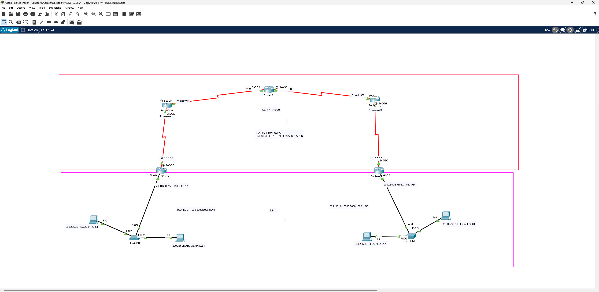

# IPv6 over IPv4 Tunneling (GRE)

## 📖 الوصف
مشروع يطبق تقنية **GRE Tunneling** (Generic Routing Encapsulation) لنقل حزم **IPv6** عبر بنية تحتية تعمل بالكامل بـ **IPv4**، وهي إحدى تقنيات الانتقال (Transition Mechanisms) بين الجيلين.

## 🗺️ التصميم (Topology)

الشبكة مقسّمة إلى طبقتين:
- **الطبقة العلوية (IPv4 Core)**: 4 راوترات مترابطة بعناوين IPv4 (`71.0.0.0/30`, `61.0.0.0/30`, `51.0.0.0/30`, `41.0.0.0/30`) وتستخدم بروتوكول **OSPF Area 0** للتوجيه الديناميكي بينها
- **الطبقة السفلية (IPv6 Sites)**: موقعان محليان بعناوين IPv6 (`2000:66DE:ABCD:3344::/64` و `2000:55CE:FEFE:CAFE::/64`) يتصلان ببعض عبر نفق GRE يمر فوق شبكة الـ IPv4

### إعداد الأنفاق (Tunnels)
- Tunnel 0 (الموقع الأول): `7000:6000:5000::1/48`
- Tunnel 0 (الموقع الثاني): `3000:2000:1000::1/48`
- بروتوكول التوجيه داخل النفق: **RIPng**

## ⚙️ المفاهيم المطبقة
- إعداد واجهة Tunnel وتحديد `tunnel source` و `tunnel destination`
- تغليف حزم IPv6 داخل حزم IPv4 (Encapsulation) عبر GRE
- تشغيل OSPF على الشبكة الأساسية IPv4 وRIPng داخل النفق لـ IPv6
- فهم سيناريوهات الانتقال التدريجي من IPv4 إلى IPv6 (Dual-layer network)

## 🎯 الهدف من المشروع
محاكاة سيناريو واقعي لشركة تمتلك بنية تحتية IPv4 قديمة وتحتاج لربط مواقع تعمل بـ IPv6 دون تغيير الشبكة الأساسية، عبر تقنية الأنفاق (Tunneling).

## 📂 الملف
- [`IPv6-IPv4-Tunneling-GRE.pkt`](./IPv6-IPv4-Tunneling-GRE.pkt) — ملف Packet Tracer الكامل
